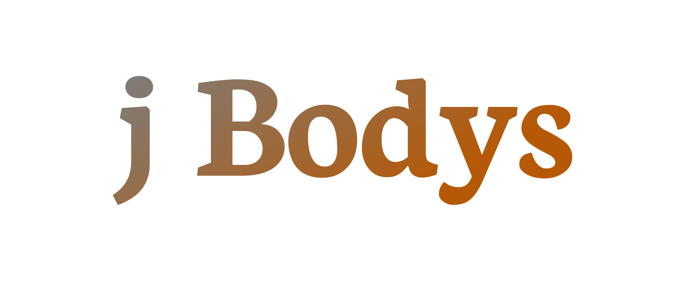
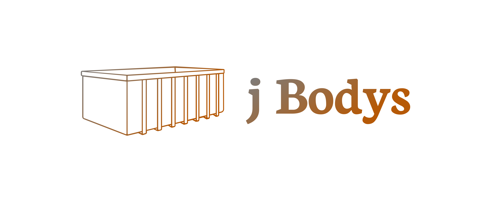
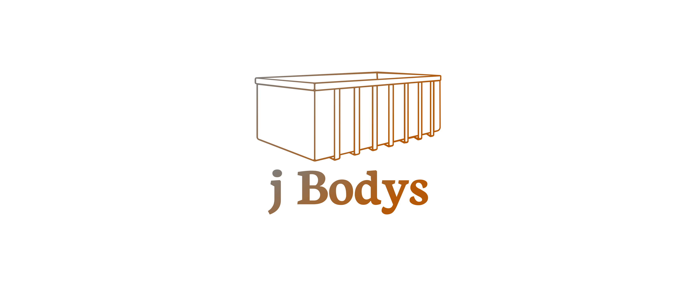
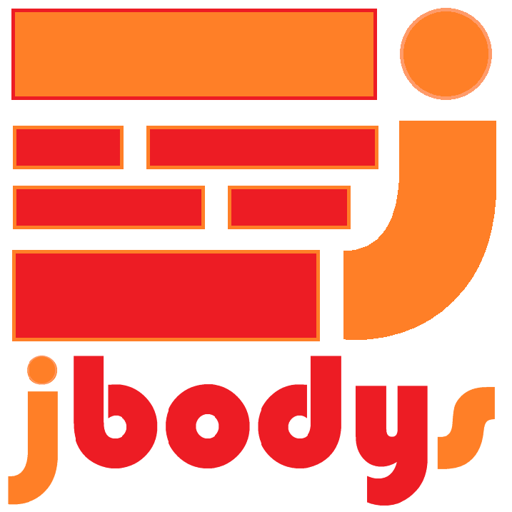
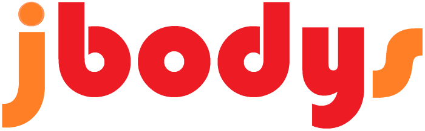

# Logotyp jBodys

## Font

Font in use <a target="_blank" href="https://fonts.google.com/specimen/Neuton">Neuton-Bold</a> designed by
<a target="_blank" href="https://brianskywalker.deviantart.com/">Brian Zick</a>
and licensed under
<a target="_blank" href="http://scripts.sil.org/cms/scripts/page.php?site_id=nrsi&amp;id=OFL_web">Open Font License.</a>
  Icon Designed by
  <a target="_blank" href="https://thenounproject.com/flrian">Flørian Hamoline</a>

# Colors

## Font

    #7D7D7D, #B65906

## Background
    
    transparent

## Icon

    #7D7D7D, #B65906

# Logo

## 1

## 2

## 3

# logo
Logotyp jBodys

